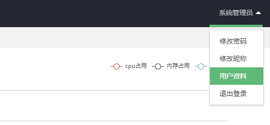
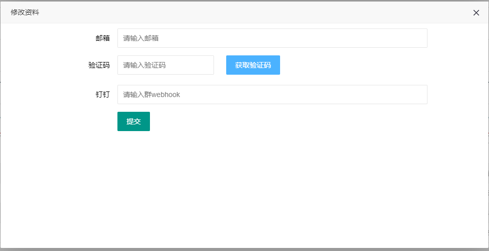

## 用户属性会包含

1. 登录名
2. 昵称
3. 密码
4. 用户资料

###  设置用户资料

1. 用户登录，打开用户资料

   

2. 设置通知地址

    
    
> 设置通知邮箱需先配置发件邮箱。请先到服务端后台系统管理-邮箱配置中设置，详情请查看[邮箱配置](系统管理/邮箱配置.md)

> 钉钉群

    获取自定义机器人webhook
    在机器人管理页面选择“自定义”机器人，输入机器人名字并选择要发送消息的群。如果需要的话，可以为机器人设置一个头像。点击“完成添加”，完成后会生成Hook地址，如下图：
    点击“复制”按钮，即可获得这个机器人对应的Webhook地址，其格式如下：
        https://oapi.dingtalk.com/robot/send?access_token=xxxxxxxx
   
 

### 授权用户权限

1. 按照节点授权项目
    1. 授权节点管理员
    2. 授权具体项目
    3. 授权是否拥有上传文件权限
    4. 授权是否拥有删除文件权限
2. 按照节点授权tomcat
    1. 授权是否拥有上传文件权限
    2. 授权是否拥有删除文件权限
3. 授权范围管理员
